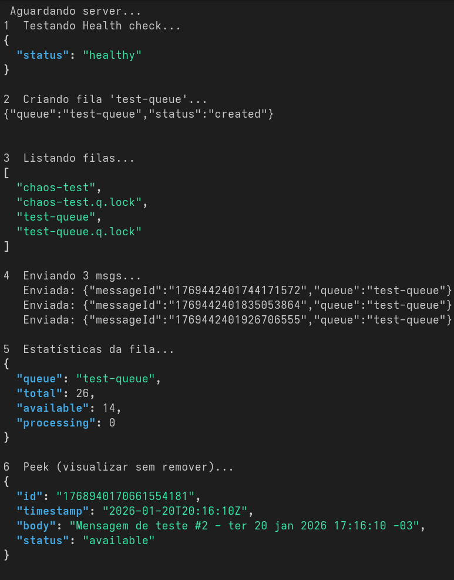

# Bash MQ
  É um sistema simples de mensageria, utilizando arquivos como armazenamento e socat como servidor HTTP. Ele oferece filas, envio, recebimento e exclusão de mensagens de forma leve e portátil.

# Funcionalidades principais
Criar filas
Listar filas existentes
Enviar mensagens
Receber mensagens (bloqueio cooperativo por status)
Visualizar próxima mensagem (peek)
Excluir mensagens
Obter estatísticas da fila
Health check para monitoramento
Endpoints HTTP
Health Check
GET /health
Retorna um JSON básico indicando que o servidor está saudável.

Criar filas
POST /queue/{queueName}
Cria uma fila no diretório configurado.

Listar filas
GET /queues
Retorna uma lista JSON com todas as filas.

Enviar mensagem
POST /queue/{queueName}/send
Corpo JSON é armazenado como mensagem.
Resposta inclui o ID gerado da mensagem.

Receber mensagem
GET /queue/{queueName}/receive
Seleciona a próxima mensagem com status available, marca como processing e retorna seu JSON.

Visualizar proxima
GET /queue/{queueName}/peek
Retorna a próxima mensagem disponível sem modificar seu status.

Excluir mensagem
DELETE /queue/{queueName}/message/{messageId}
Remove permanentemente a mensagem.

Estatisticas
GET /queue/{queueName}/stats
Retorna contagem total, disponíveis e em processamento.

Logs
Gerados em mini-sqs.log (local) ou no diretório configurado via variável de ambiente.

Diretorios
QUEUE_DIR: local onde as filas são armazenadas
LOG_FILE: arquivo de log
Para persistencia cada fila é um arquivo.

Use o script:
./start-sqs.sh
Ele detecta o ambiente, configura diretorios, prepara variaveis.

# Valide as funcionalidades

./test.sh

